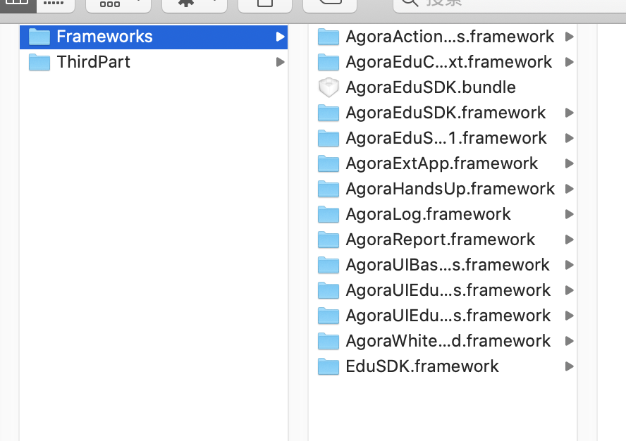
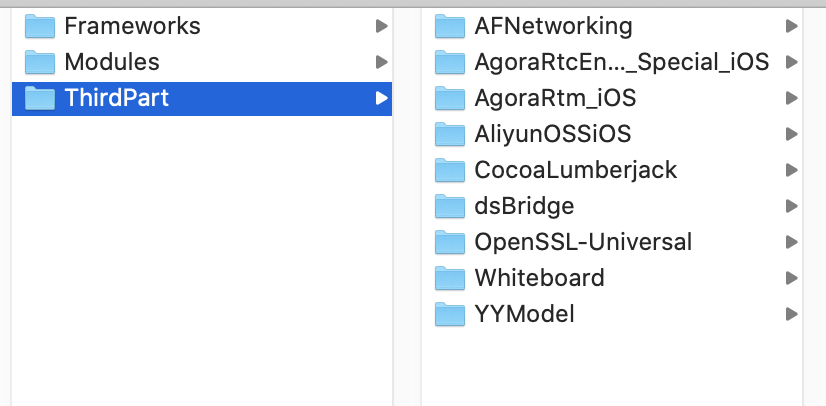
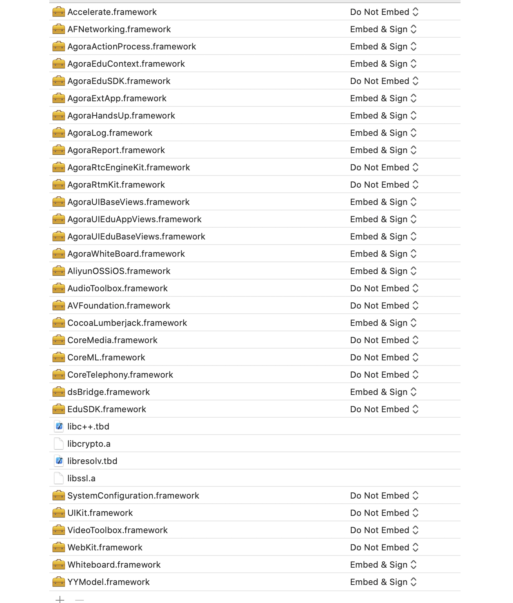

1. 下载aPaaS SDK, 我们提供了2个Swift版本下载链接：
 [5.3.2下载链接](https://download.agora.io/sdk/release/Frameworks-1.1.0.zip)
 [5.4下载链接](https://download.agora.io/sdk/release/AgoraClassroomSDK-1.1.0-5.4.zip)
> 可以在Terminal里面输入Swift -version，查看当前Swift版本。

2. [下载aPaaS依赖库SDK](https://github.com/AgoraIO-Community/CloudClass-iOS/releases/download/v1.1.0.1/ThirdPart.1.1.0.zip)：
依赖库里面包含：AFNetworking、AgoraRtcEngine_Special_iOS、AgoraRtm_iOS、AliyunOSSiOS、CocoaLumberjack、dsBridge、OpenSSL-Universal、Whiteboard、YYModel

3. 把aPaaS SDK解压到AgoraEduSDK/Frameworks文件夹里面

4. 把依赖库解压到AgoraEduSDK/ThirdPart文件夹里面

5.  添加系统依赖库 &  设置动态库Embed & Sign:
AgoraRtcEngineKit.framework
Accelerate.framework
AudioToolbox.framework
AVFoundation.framework
CoreMedia.framework
libc++.tbd
libresolv.tbd
SystemConfiguration.framework
CoreML.framework
VideoToolbox.framework

设置动态库Embed & Sign:
AgoraActionProcess、AgoraEduContext、AgoraExtApp、AgoraHandsUp、AgoraLog、AgoraReport、AgoraUIBaseViews、AgoraUIEduAppViews、AgoraUIEduBaseViews、AgoraWhiteBoard、AFNetworking、AliyunOSSiOS、CocoaLumberjack、dsBridge、Whiteboard、YYModel

6. 配置CoreML.framework
如果是你自己的项目， 需要配置CoreML.framework为Optional。
在Build Phases=>Link Binary With Library， 选择CoreML.framework为Optional

7. 配置Objc链接
如果是你自己的项目， 需要配置Objc链接：
在Build Settings=>Other Linker Flags=> 添加-Objc

8. 上架移除模拟器架构
集成了 SDK 包中考虑模拟器调试方便 ，添加了模拟器架构。你需要在将 app 发布至 App Store 前移除 x86_64和 i386架构。

在终端中运行如下命令，移除 x86_64 架构。注意将 ALL_ARCHITECTURE/AgoraRtcKit.framework/AgoraRtcKit 替换为动态库在你项目中的路径。

lipo -remove x86_64 ALL_ARCHITECTURE/AgoraRtcKit.framework/AgoraRtcKit -output ALL_ARCHITECTURE/AgoraRtcKit.framework/AgoraRtcKit

